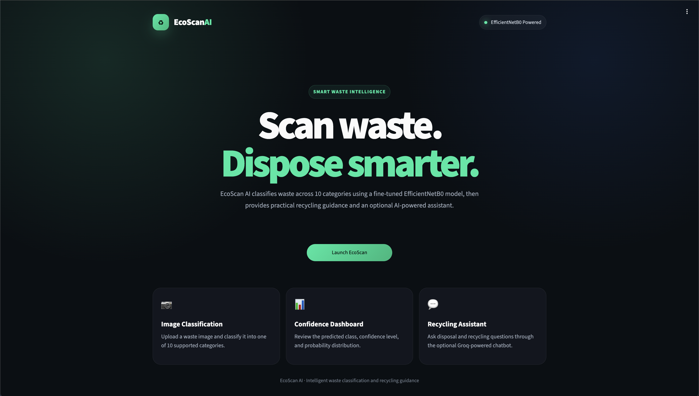
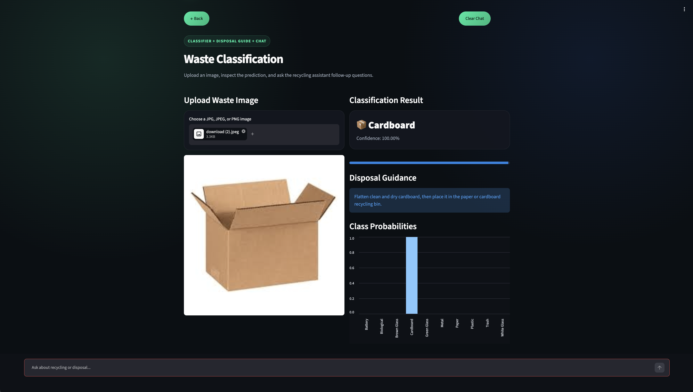
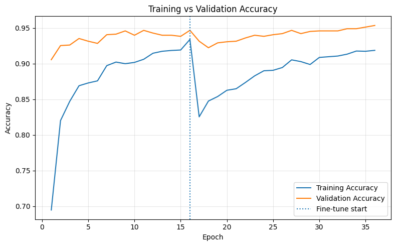
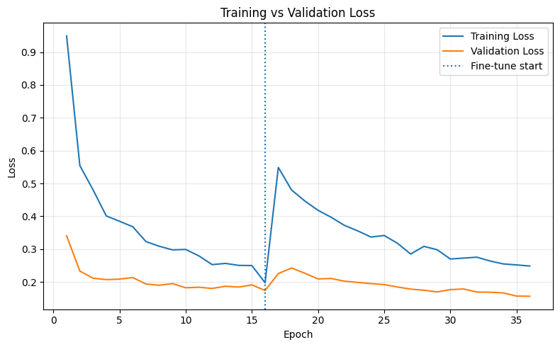
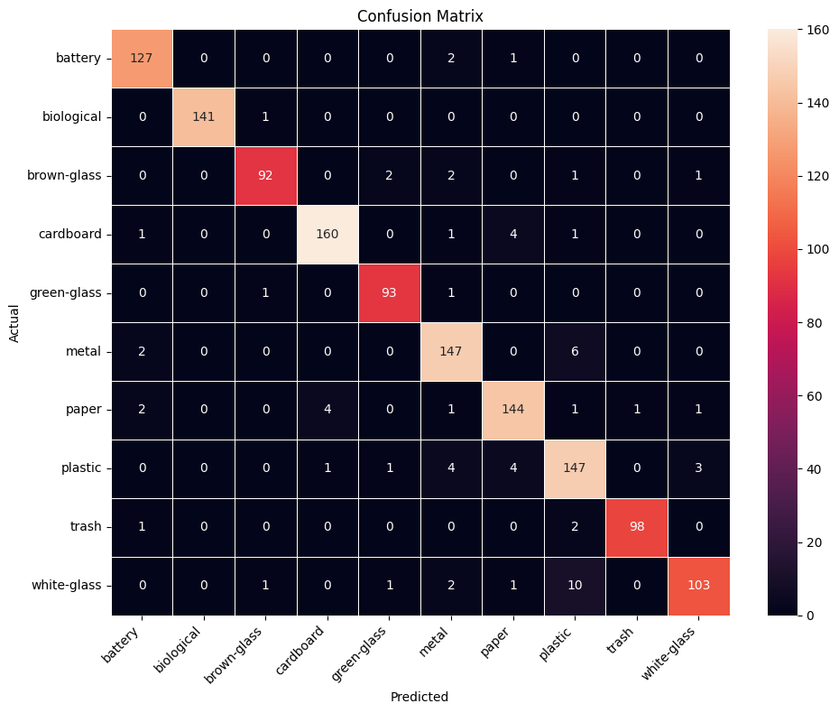

# Smart Waste Classification

An AI-powered waste classification system built with **EfficientNetB0**, **TensorFlow**, **Streamlit**, and the **Groq API**.

The application classifies household waste images into 10 categories, displays prediction confidence and class probabilities, provides disposal guidance, and includes an optional AI-powered recycling assistant.



---

## Features

- Classifies waste images into 10 categories
- Uses a fine-tuned EfficientNetB0 model
- Displays the predicted class and confidence score
- Visualizes probabilities for all supported classes
- Provides practical recycling and disposal guidance
- Includes an optional Groq-powered recycling assistant
- Offers a modern Streamlit user interface
- Provides the trained model through GitHub Releases

---

## Supported Waste Classes

The model supports the following categories:

1. Battery
2. Biological
3. Brown Glass
4. Cardboard
5. Green Glass
6. Metal
7. Paper
8. Plastic
9. Trash
10. White Glass

---

## Application Preview

### Landing Page


### Classification Result



---

## Model Performance

The released EfficientNetB0 model achieved the following test results:

| Metric | Result |
|---|---:|
| Test Accuracy | 95.00% |
| Test Loss | 0.1585 |
| Input Size | 224 × 224 |
| Number of Classes | 10 |

### Training Accuracy



### Training Loss



### Confusion Matrix



---

## Model Architecture

The project uses **EfficientNetB0** as the feature extraction backbone.

The model workflow includes:

- Image resizing to 224 × 224
- Image preprocessing
- Data augmentation
- EfficientNetB0 transfer learning
- Global average pooling
- Dropout regularization
- Dense classification layer
- Softmax output for 10 waste categories

---

## Dataset

The model was trained using the **Garbage Classification Dataset** available on Kaggle.

Dataset link:

https://www.kaggle.com/datasets/namanjain001/garbage-classification-dataset

The dataset contains images belonging to 10 household-waste categories used for training and evaluating the classification model.

---

## Technologies Used

- Python
- TensorFlow
- Keras
- EfficientNetB0
- Streamlit
- Groq API
- NumPy
- Pillow
- Matplotlib
- Seaborn
- Scikit-learn
- Python Dotenv

---

## Repository Structure

```text
smart-waste-classification/
├── assets/
│   ├── app_landing.png
│   ├── app_prediction.png
│   ├── confusion_matrix.png
│   ├── training_accuracy.png
│   └── training_loss.png
├── model/
│   └── .gitkeep
├── .env.example
├── .gitignore
├── app.py
├── class_names.json
├── requirements.txt
├── smart_waste_classification.ipynb
└── README.md
```

---

## Installation

### 1. Clone the Repository

```bash
git clone https://github.com/nourelden08/smart-waste-classification.git
cd smart-waste-classification
```

You can also download the repository as a ZIP file and extract it.

### 2. Create a Virtual Environment

Python 3.12 is recommended.

#### macOS or Linux

```bash
python3.12 -m venv .venv
source .venv/bin/activate
```

#### Windows

```bash
python -m venv .venv
.venv\Scripts\activate
```

### 3. Install the Required Packages

```bash
python -m pip install --upgrade pip
pip install -r requirements.txt
```

---

## Download the Trained Model

The trained model is stored in GitHub Releases because it is too large to include directly in the repository.

Download the model from:

https://github.com/nourelden08/smart-waste-classification/releases/download/v1.0.0/garbage_efficientnetb0.keras

After downloading it, place the model inside the `model` directory:

```text
model/garbage_efficientnetb0.keras
```

The final model directory should look like this:

```text
model/
├── .gitkeep
└── garbage_efficientnetb0.keras
```

---

## Groq API Setup

The image classification feature works without a Groq API key.

The Groq API is only required for the AI recycling assistant.

### 1. Create the Environment File

Copy `.env.example` and rename the copy to `.env`.

On macOS or Linux:

```bash
cp .env.example .env
```

On Windows, manually create a file named:

```text
.env
```

### 2. Add Your Groq API Key

Open `.env` and add your own key:

```env
GROQ_API_KEY=your_real_groq_api_key_here
```

Do not upload your `.env` file or API key to GitHub.

Each person who downloads the project must use their own Groq API key.

---

## Run the Application

Start the Streamlit application with:

```bash
python -m streamlit run app.py
```

For macOS file-watcher issues, use:

```bash
python -m streamlit run app.py --server.fileWatcherType none
```

Then open the following address in your browser:

```text
http://localhost:8501
```

---

## How to Use

1. Start the Streamlit application.
2. Click **Launch EcoScan**.
3. Upload a JPG, JPEG, or PNG waste image.
4. Review the predicted waste category.
5. Check the prediction confidence.
6. Review the probability distribution.
7. Read the disposal guidance.
8. Ask the recycling assistant additional questions when a Groq API key is configured.

---

## Training Notebook

The complete training, evaluation, and model-export workflow is available in:

```text
smart_waste_classification.ipynb
```

The notebook includes:

- Dataset loading
- Image preprocessing
- Data augmentation
- EfficientNetB0 model construction
- Model training
- Performance evaluation
- Training-history visualization
- Confusion matrix generation
- Model saving

---

## Environment Variables

The application uses the following optional environment variable:

| Variable | Purpose |
|---|---|
| `GROQ_API_KEY` | Enables the AI recycling assistant |

An example is provided in:

```text
.env.example
```

The real `.env` file is excluded from GitHub through `.gitignore`.

---

## Security

- API keys are loaded through environment variables.
- The real `.env` file is excluded from version control.
- Only `.env.example` is included in the repository.
- Users must provide their own Groq API key.
- No API key is stored directly inside `app.py`.

---

## Limitations

- Predictions depend on image quality, lighting, and object visibility.
- The model only supports the 10 categories used during training.
- Objects outside the supported classes may be classified incorrectly.
- Recycling and disposal rules may differ by country or local authority.
- The disposal guidance is general and should be checked against local regulations.

---

## Author

**Nourelden Essam**

AI Engineer and Co-Founder of FN Lab

GitHub:

https://github.com/nourelden08

---

## Acknowledgments

- The Garbage Classification Dataset published on Kaggle
- TensorFlow and Keras
- EfficientNetB0
- Streamlit
- Groq
